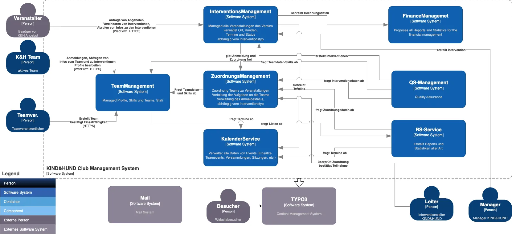

# KIND&HUND Club Management and Website

Die Extension wird von der [conPassione gmbh](https://www.conpassione.ch) zur Verfügung gestellt.

KIND&HUND ist ein Verein, welcher sich um den Themenkomplex Kinder und Hunde
kümmert. Er organisiert Präventionseinsätze in Schulen, Einzelinterventionen
für Kinder mit Hundeangst und Lesehundeinsätze für Kinder mit Leseschwäche.
Zudem bildet der Verein Klassenhunde und Besuchshunde aus, welche mit ihrer
Präsenz in der Klasse zur Verbesserung des sozialen Klimas beitragen, die
Klasse ruhiger und konzentrierter machen.

Um die verschiedenen Ausbildungen und Einsätze von KIND&HUND zu unterstützen
wurde das KIND&HUND Club Management and Website erstellt.

Die erste Version stammt aus dem Jahre 2010. Seither wurde das System und
die Website kontinuierlich weiterentwickelt.

# Architektur
Die Architektur wurde mit der C4-Methode erstellt.

# Komponenten
## TeamManagement
Hier wird alles, was ein Team betrifft abgearbeitet. Von der Anmeldung als
neues Team über die Ausbildung, die Anmeldung für Weiterbildungen, die
Verwaltung des Profils und der Skills, etc.
